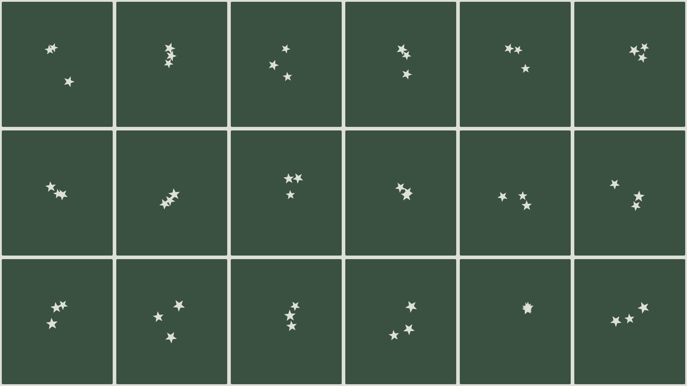
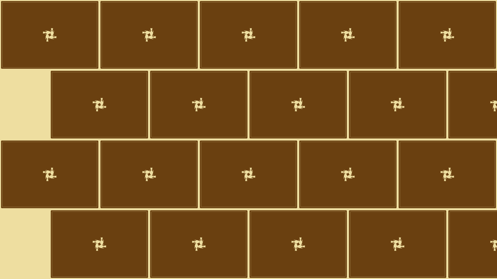
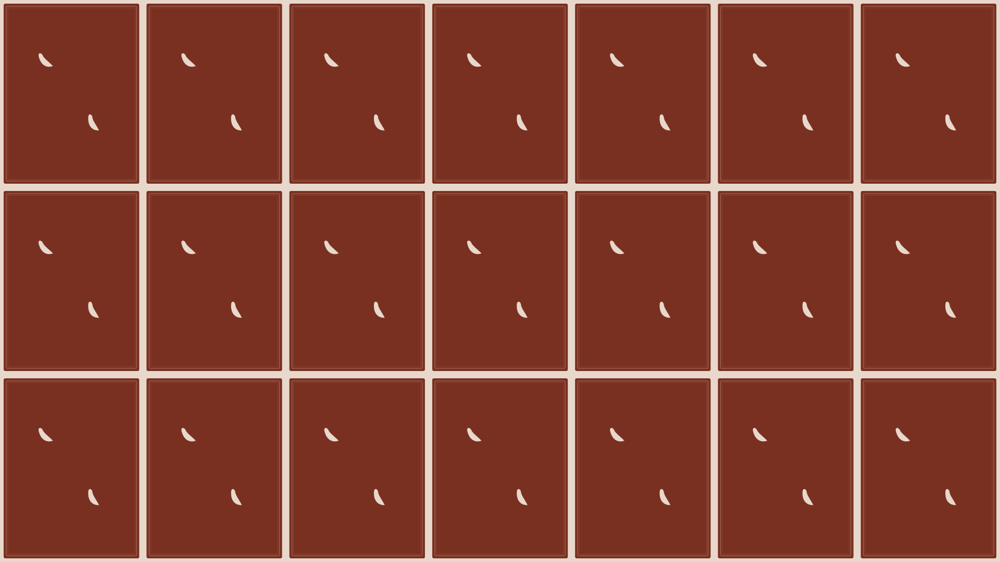
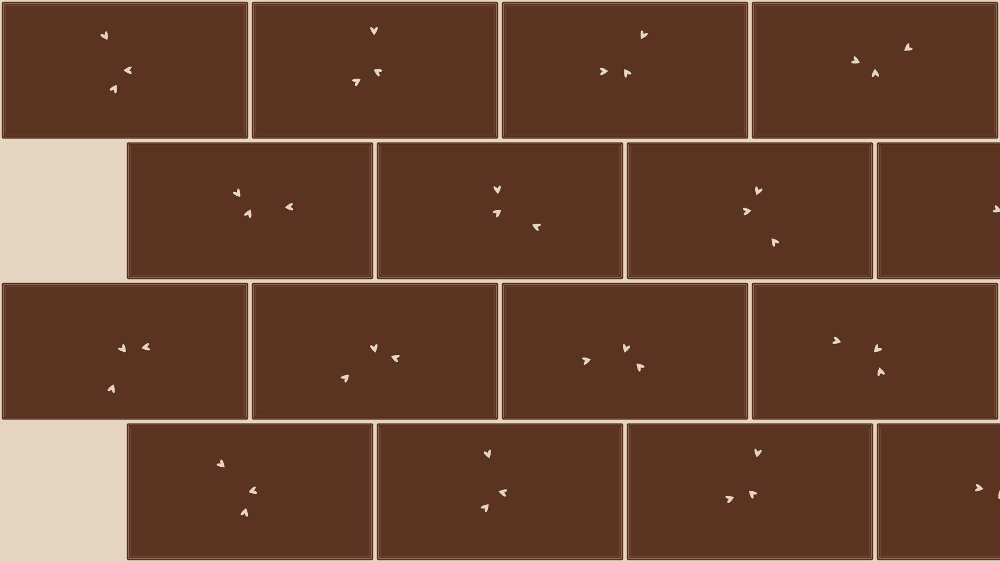
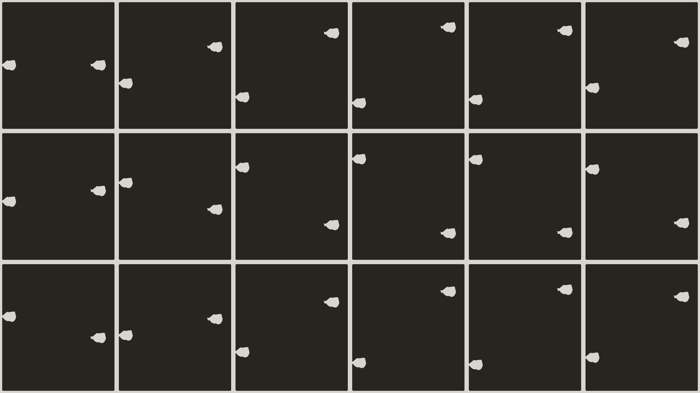

# Baffle Pattern Generator

An interactive, single-page HTML tool for generating decorative baffle (acoustic panel) patterns with customizable leaf shapes, layout modes, and color palettes.

## Features

- **23 leaf shapes** — Palm, Banana, Monstera, Needle, Oak, Maple, Fern, Willow, Aloe, Hemp, Arrow, Circle, Diamond, Triangle, Hexagon, Star, Heart, Drop, Crescent, Cross, Spike, Ring, Petal
- **7 layout modes** — Random Scatter, Grid Repeat, Radial Rosette, Flowing Rows, Wave, Spiral, Diagonal
- **16 color palettes** — Sage, Onyx, Clay, Slate, Ochre, Ash, Ink, Rust, Dusk, Fern, Sand, Charcoal, Teal, Terracotta, Stone, Midnight
- **Panel frame styles** — None, Thin Border, Inset Groove, Double Rule
- **Adjustable** columns, rows, leaf size, leaf count, gap, and row offset
- **Export** to PNG (2400px) or SVG
- **Randomize** button for quick inspiration
- **Dark mode** support
- **Animated** leaves with subtle swaying motion

## Screenshots

## Usage

1. **Open** `palm-baffle-pattern.html` in any modern browser.
2. **Choose** a pattern mode, leaf shape, and panel frame from the pill buttons.
3. **Adjust** columns, rows, leaf size, leaf count, and gap with the sliders.
4. **Toggle** row offset for a staggered grid.
5. **Pick** a color palette from the swatches.
6. **Export** your design as PNG or SVG.
7. **Click** Randomize for unexpected combinations.

No build step, no dependencies — just open and use.

## How it works

The tool draws a grid of panels on an HTML5 Canvas (or renders SVG for export). Each panel is clipped to rounded-rect bounds. Within each panel, leaves are drawn using cubic Bezier curves and positioned according to the selected layout mode. A seeded pseudo-random number generator ensures consistent scatter positions across renders.

## License

MIT
